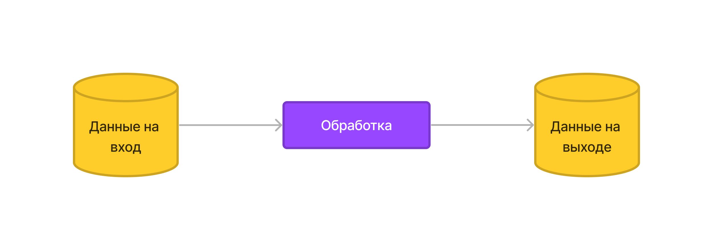
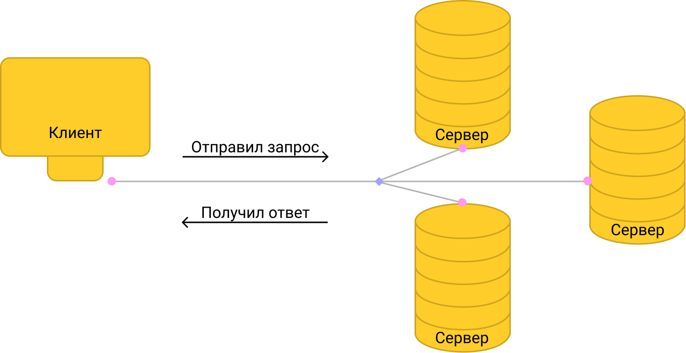

# Тестовое задание

**Проект:** "Цифровой след: инфраструктура" #1692 \
**Позиция:** Стажер-разработчик и Разработчик / Программист

## Задание

1. Требуется найти и получить информацию об API (REST, GraphQL, JSON-RPC и т.п.). Исследовать его возможности и расписать это в отчет. Однако задача этим не ограничивается. После анализа требуется создать приложение-обертку или скрипт, которые позволят не вникая в API получить информацию в виде выгрузки в базу данных (например, Clickhouse или Postgres)
2. Переделать скрипт чтоб он постоянно считывал / проверял данные, а не единоразово призапуске. Это можно сделать через webhook-и если они поддерживаются или другимиспособами (периодичными запросами, ws и т.д.). Также добавить к скрипту маршрут для сбораметрик Prometheus.
3. Упаковать скрипт из пункта 2 в образ.

***

## Оглавление

1. [Общая теоретическая справка](#api-application-programming-interface-общая-информация)
2. [Rest API](#rest-api)

***

### API (Application Programming Interface). Общая информация

***
\
API - Это набор способов и правил по которым различные программы взаимодействуют и обмениваются данными, если выразить это определение одним словом то получится контракт, в котором одна сторона обязуется предоставить необходимые данные на вход, чтобы получить желаемый результат, в то время как вторая сторона обязуется эти данные должным образом обработать и выдать запрашиваемый результат. Эта система называется интерфейсом из-за того, что при взаимодействии систем, скрывается реализация внутренних процессов каждой из них.

Хорошим примером тут будет кнопка звонка на телефоне: для пользователя важно лишь наличие этой кнопки, но при этом абсолютно не имеет значения, сенсорная она или физическая, или то как конкретно это кнопка обрабатывает нажатие. То есть API позволяет получить желаемый результат не вникая в способ его получения. API широко используются в различных областяз, начиная от ОС заканчивая веб-приложениями. В конечном итоге API, можно характеризовать как набор функций.

***
\

***
\
**Использование API имеет следующие плюсы:**

1. Предоставление доступа к готовым инструментам - разработчикам нет необходимости каждый раз заново "изобретать велосипед" для взаимодействия с ОС или веб-сервисом. Благодаря наличию API они сразу могут перейти к разработке непосредственно своего продукта;
2. Повышение безопасности - благодаря сокрытию реализации внутренней логики систем, уменьшается вероятность некорректного использования тех или функций. Так же под повышением безопасности можно рассматривать тот факт, что над API работает организация или сообщетсво разработчиков занятых разработкой, исправением багом и уязвимостей и полноценной поддержкой конкретного решения.
3. Снижение стоимости разработки - данный плюс прямо вытекает из первого пункта, имея готовые инструменты, теряется необходимость в оплате времени и труда людям занятым разработкой собственных решений. Благодаря чему можно более эффективно расходовать бюджет.

Стоит отдельно отметить факт отсутствия чётких требований, то есть реализация и функционал каждого из API зависит от его команды разработчиков и именно команда в праве реализовывать тот функцианал и логику, которая по их мнению необходима проекту.

***

**Способы вызова API**
\
Глобально способы вызова API можно разделить на два типа: напрямую и косвенно.

**Напрямую:**

1. Внутрисистемный вызов - разные части одной системы взаимодействую друг с другом;
2. Межсистемный вызов - взаимодействие между двумя системами, когда одна из них хочет получить что-то из второй;
3. Вызов метода человеком - одна из целей применения - локализация бага;
4. Вызов метода автотестами - проверка функционала программы.

**Косвенно:** применяется при взаимодействии клиента с GUI.

***

### Rest API

***
**Клиент-серверная архитектура** - Давайте начнем с краткого обзора клиент-серверной архитектуры. Это архитектура подразумевающая взаимодействие клиента и сервера, где клиент - потребитель услуг, а сервер - поставщик, причем внутрення реализация сервера закрыта от потребителя, как и наоборот. На рисунке ниже показано их взаимосвязь.



**Rest API**
Rest API - архитектурный стиль, набор правил, как эффективнее всего строить API, при это использование Rest делает систему:

- Производительной
- Масштабируемой;
- Гибкой к изменениям;
- Отказоустойчивой;
- Простой в поддержке.

Достигаются данные свойства, благодаря соблюдению шести принципов Rest:

1. Использование клиент-серверной архитектуры, описанной ранее. Данная архитектура обеспечивает масштабируемость, так как при увеличении нагрузка, благодаря неизменной точке взаимодействия можно увеличивать производительность системы незаметно от пользователя;
2. У сервера не должно быть какого либо состояния - те каждое новое взаимодействие для клиента и сервера происходит, как в первый раз. Клиент каждый раз должен отправлять всю необходимую полную информацию, необходимую для выполнения запроса. Это уменьшает время обработки каждого запроса, ведь не надо хранить и вычислять информацию основываясь на предыдущих запросах. Обеспечивает более легкую масштабируемость, ведь если сервера ничего не хранят, то можно опять же расширяться незаметно от пользователя. Упрощение поддержки из-за более элементарного взаимодействия.
3. Кэширование - хранение определённой информации отправляемой в ответ на пользовательский запрос это позволяет ускорить работу сервера. Тут стоит привести пример, чтобы не возникло аналогий, что кэширование = хранение состояния. При кэшировании мы храним не данные о конкретном пользователе, мы храним запросы и ответы, для их повторного использования, причем не обязательно пользователем который первый отправил запрос. К примеру, рассмотрим два алгоритма при кэшировании и хранении состояния:

    - Кэширование: пользователь 1 отправляет запрос на сервер, "какая погоды в Москве". Сервер запрашивает у метеостанции эту информацию, отправляет ее пользователю и сохраняет ее в своем кэше, пользователь 2 отправляет тот же запрос, и благодаря кэшу серверу нет необходимости снова обращаться к метеостанции. То есть кэширование сокращает количество промежуточных запросов, но при этом не хранит информацию о конкретных пользователях и при повторном запросе пользователем 1 погоды в мск, у сервера не будет ассоциаций этой информации и пользователя 1, и взаимодействие будет как будто первый  раз.
    - Хранение состояния: пользователь отправляет запрос серверу, какая погода в москве 14 октября, сервер отсылает ему это информацию и сохраняет, что пользователь 1 спрашивал про 14 октября. Потом пользователь 2 спрашивает аналогичный вопрос, но про 16 октября, сервер опять же отправляет и это сохраняет. Потом если пользователь 1 спросит про погоду на следующий день, сервер будет помнить, что для пользователя 1 след. день это 15 октября и выдаст на это ответ, по аналогичной логике для пользователя 2. То есть хранение состояния создает ассоциации между данными и пользователями и второе и тд взаимодействие проходит с учетом этого.
4. Многоуровневость системы - согласно Rest API система может иметь сколько угодно слоев, при этом с точки зрения клиента, она представляется единым целым. Это упрощает масштабирование благодаря неизменности интерфейса взаимодействия.
5. Единообразный унифицированный интерфейс - Принцип Rest согласно которому сервер возвращает не только запрашиваемый ресурс, но и всю связанную с ним информацию. Это обеспечивает более гибкое взаимодействие и большую свободу для клиента, но и усложняет логику этого взаимодействия.
6. Code on done (Код по требованию) - принцип согласно которому на запрос пользователя, сервер отправляет не только код для отображения, но и исходный код, который исполнится на стороне клиента. Это позволяет две вещи - 1-я опять же делает действия клиента более гибкими, 2-я упрощение поддержки, если мы захотим изменить что-то в коде, то достаточно просто поменять это на сервере и передать пользователю новый код.

С точки зрения создателя этой концепции существует ровно один необязательный принцип - code on done. Всё остальное обязано быть выполнено, иначе это уже не Rest подход, так же Rest связан с HTTP протоколом. А если быть совсем точным, то Rest задуман создателем так, чтобы максимально удобно работать с HTTP.

**HTTP (HyperText Transfer Protocol)** - протокол прикладного уровня, описывающий список правил по которым компьютеры обмениваются информацией в интернете.

HTTP запрос имеет следующуюю структуру:

| Название | Структура |
|----------|-----------|
|Стартовая строка|```POST /login HTTP/1.0``` метод - POST, URL - /login, версия - HTTP/1.0|
| Заголовки | Отправляются служыбные данные, по типу адрес хоста, тип контента, размер контента и тд. |
| Тело сообщения | Опционально, в нем пользователь отправляет серверу необходимые данные|

HTTP ответ:

| Название | Структура |
|----------|-----------|
| Cтрока статуса|```HTTP/1.1 200 OK``` версия - HTTP/1.1, статус код 200|
| Заголовки | Отправляются служыбные данные, по типу адрес хоста, тип контента, размер контента и тд. При этом заголовок ответа может отличаться от заголовка запроса.|
| Тело сообщения | Опционально, в нем сервер отправляет пользователю необходимые данные. При этом тело ответа может отличаться от заголовка запроса.|

В HTTP есть несколько методов, основные из них:

- GET - получение ресурса
- POST - передача данных
- PUT - обновление ресурса
- PATCH - обновление фрагмента ресурса
- DELETE - удаление ресурса
